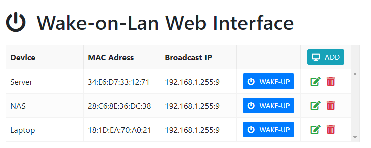

[](http://golang.org) [](http://golang.org) [](http://golang.org)


# Web interface for sending Wake-on-lan (magic packet)

A GoLang based HTTP server which will send a Wake-on-lan package (magic packet) on local network. The request can be send using web interface or directly using HTTP request with mapped device name in the URL. The only computing device I have running 24x7 is handy-dandy Raspberry Pi 4 (4gb) with docker containers. All other devices like server, laptop and NAS as powered only when I need them. I needed a way to easily turn them on specifically when trying to automate things like nightly builds.

I use this application behind NGINX web proxy which is secured with HTTPS certificate. It has no authentication, but it is home network and the reason I built this was to have no authentication. I have the same functionality provided in my home router, but I have to login and go through several clicks. Also, this app runs as docker image so even if it is hacked, it reduces the attack surface.

I have bookmarked direct link to device(s) on my browsers to wake them using single HTTP call for ease of access.

Things I use this for:
- to wake-up my home laptop remotely. I use my home laptop remotely over RDP.
- this is also helpful in building routines which will wake up my server and nightly builds and when it is all done, go back to sleep. I don't keep my home lab running 24x7 as it is a waste of energy.
- to turn on my NAS and laptop to start the weekly backup from laptop to NAS.
- to turn on NAS quickly when we are watching movies stored on NAS.

> It was tricky to configure the wol feature on my Dell Laptop. NAS and Dell servers were easy to configure. Follow this article for [Dell laptop](https://www.dell.com/support/article/en-us/sln305365/how-to-setup-wake-on-lan-wol-on-your-dell-system?lang=en) 

## Bootstrap UI with JS Grid for editing data



The UI features CRUD operation implemented using [js-grid.com](https://github.com/tabalinas/jsgrid) plugin. 

### Wake-up directly using HTTP Request

/wolweb/wake/**&lt;hostname&gt;** -  Returns a JSON object

```json
{
  "success":true,
  "message":"Sent magic packet to device Server with Mac 34:E6:D7:33:12:71 on Broadcast IP 192.168.1.255:9",
  "error":null
}
```

## Configure the app

The application will use the following default values if they are not explicitly configured as explained in sections below.

| Config | Description | Default
| --- | --- | --- |
| Port | Define the port on which the webserver will listen | **8089**
| Virtual Directory | A virtual directory to mount this application under | **/wolweb**
| Broadcast IP and Port | This is broadcast IP address and port for the local network. *Please include the port :9* | **192.168.1.255:9**

You can override the default application configuration by using a config file or by setting environment variables. The application will first load values from config file and look for environment variables and overwrites values from the file with the values which were found in the environment.

**Using config.json:**

```json
{
    "port": 8089,
    "vdir":"/wolweb",
    "bcastip":"192.168.1.255:9"
}
```
**Using Environment Variables:**

*Environment variables takes precedence over values in config.json file.*

| Variable Name | Description
| --- | --- |
| WOLWEBPORT | Override for default HTTP port
| WOLWEBVDIR | Override for default virtual directory
| WOLWEBBCASTIP | Override for broadcast IP address and port

## Devices (targets) - devices.json format
```json
{
    "devices": [
        {
            "name": "Server",
            "mac": "34:E6:D7:33:12:71",
            "ip": "192.168.1.255:9"
        },
        {
            "name": "NAS",
            "mac": "28:C6:8E:36:DC:38",
            "ip": "192.168.1.255:9"
        },
        {
            "name": "Laptop",
            "mac": "18:1D:EA:70:A0:21",
            "ip": "192.168.1.255:9"
        }
    ]
}

```
## Usage with Docker

This project includes [Dockerfile (based on Alpine)](./Dockerfile) and [docker-compose.yml](./docker-compose.yml) files which you can use to build the image for your platform and run it using the docker compose file. If interested, I also have alternate [Dockerfile (based on Debian)](.Debian_Dockerfile). Both of these Dockerfile are tested to run on Raspberry Pi Docker CE. If you want to use this application as-is, you will only need to download these two docker-related files to get started. The docker file will grab the code and compile it for your platform.

> I could not get this to run using Docker's bridged network. The only way I was able to make it work was to use host network for the docker container. See this [https://github.com/docker/for-linux/issues/637](https://github.com/docker/for-linux/issues/637) for details.

### With docker-compose
```bash
docker-compose up -d
```

### Build and run manually
```bash
docker build -t wolweb .
docker run --network host -it wolweb
```

### Extract the compiled application from an image
```bash
docker cp wolweb:/wolweb - > wolweb.gz
```

## Build on Windows
I use VS Code with Go extension. To build this project on Windows:
```powershell
go build -o wolweb.exe .
```

## Build for ASUS Routers (ARM v5)
I initially thought of running this application on my router, so I needed to build the application without having to install build tool on my router. I use the following **PowerShell** one liner to build targeting the ARM v5 platform on my Windows machine with VS Code:
```powershell
 $Env:GOOS = "linux"; $Env:GOARCH = "arm"; $Env:GOARM = "5"; go build -o wolweb .
```
Copy the file over to router and make it executable.
```sh
chmod +x wolweb
```

To see detailed instructions on how to run this application as service on ASUS router with custom firmware [asuswrt-merlin](https://www.asuswrt-merlin.net/) see this [Wiki guide](https://github.com/sameerdhoot/wolweb/wiki/Run-on-asuswrt-merlin)
## NGiNX Config

I am already using NGiNX as web-proxy for accessing multiple services (web interfaces) from single IP and port 443 using free Let's Encrypt HTTPS certificate. For accessing this service, I just added the following configuration under my existing server node.
```
	location /wolweb {
		proxy_pass http://192.168.1.4:8089/wolweb;
	}
```
> This is also the reason why I have an option in this application to use virtual directory **/wolweb** as I can easily map all requests for this application. My / is already occupied for other web application in my network.

## Credits
Thank you to David Baumann's project https://github.com/dabondi/go-rest-wol for providing the framework which I modified a little to work within constraints of environment.
